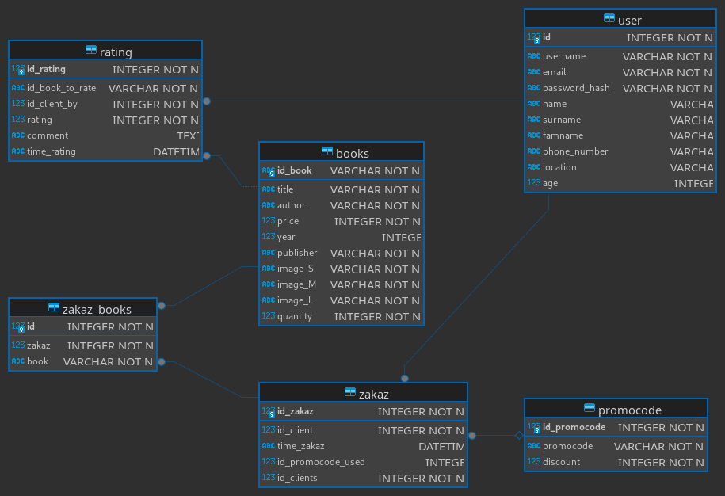
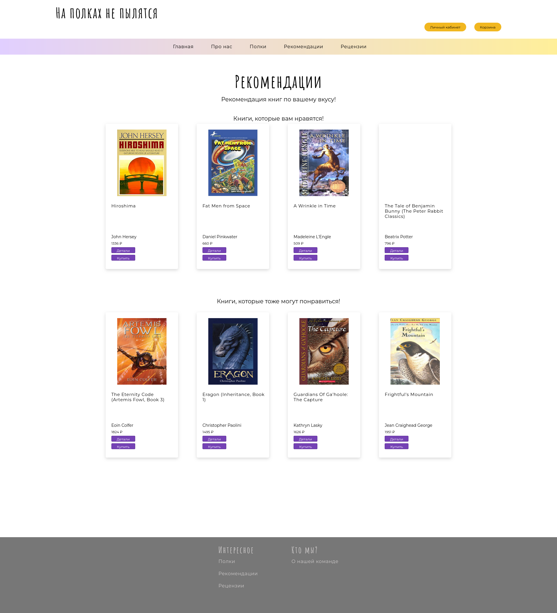

# Финальный проект - Методы анализа данных
> Онлайн-магазин книг с двумя видами рекомендаций
> Лучше смотреть презентацию bonustrack.pptx !!!

Онлайн-магазин написан с использованием фреймворка Flask.


## Схема БД


## Персональные рекомендации книг
Добавлены персональные рекомендации книг для пользователя


## Рекомендации по похожей книге
Также добавлены рекомендации на оснвое одной книги - "Найди похожее!"


## Запуск
```
docker build -t bookstore . && docker run -it bookstore
```
